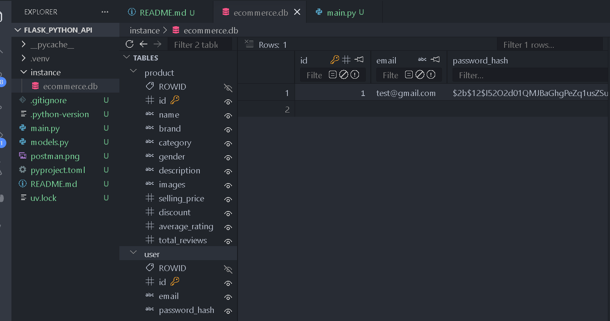
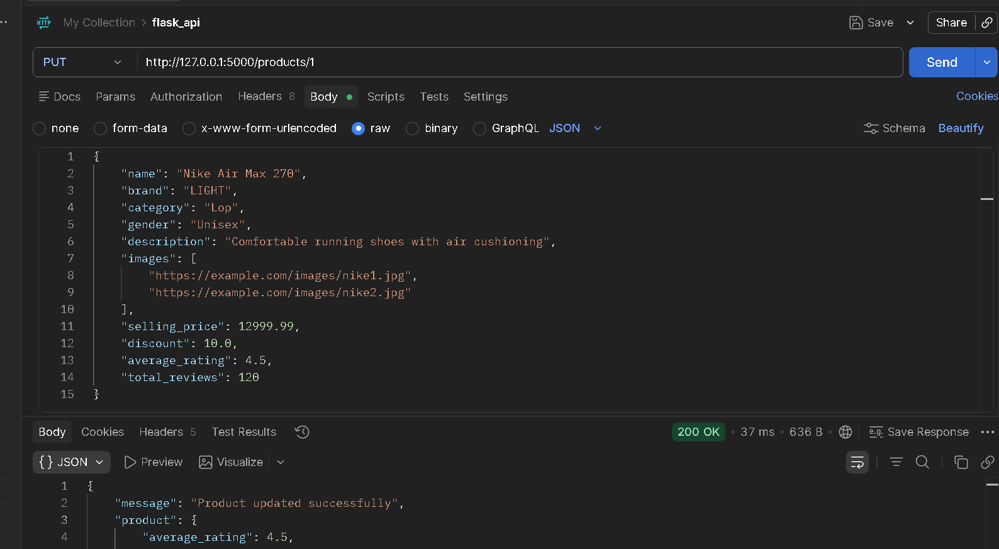

# 🛒 Product Management API (Flask)
A RESTful API built with Flask for user authentication and product management — 
supports register, login, and full CRUD operations on products.

## Features
- User Registration & Login (JWT Auth)
- Add, Update, Delete, View Products
- Postman tested endpoints
- Secure password hashing

## Tech Stack
- Python, Flask
- Flask-SQLAlchemy (Database)
- Flask-JWT-Extended (Authentication)
- Postman (API Testing)


######################
## Demo Clip
<p align="center">
  
</p>

######################


## Now let's explain the API methods

## **GET** — data fetch/retrieve from server . nothing create/modify  just read
python@app.route('/products', methods=['GET'])
def get_products():
    products = Product.query.all()
    return jsonify([...])

## **POST** ➕ — naya data create/add or send data to server  (e.g register, login, new product add).
python@app.route('/register', methods=['POST'])
def register():
    data = request.get_json()  # body se data aata hai
    
### **PUT / PATCH** = "I want to CHANGE existing data" ✏️
Updates old/existing data.

### **DELETE** = "I want to REMOVE data" 🗑️
Removes a record.


## API Endpoints

### 🔐 Auth Routes

| Method | Endpoint         | Description                     | Body (JSON) |
|--------|-----------------|----------------------------------|--------------|
| POST   | /register       | Registers a new user            | {"username":"ali", "email":"a@a.com", "password":"123"} |
| POST   | /login           | Logs in the user, returns JWT token | {"email":"a@a.com", "password":"123"} |

### 📦 Product Routes

| Method | Endpoint             | Description                        | Auth Required |
|--------|-----------------------|--------------------------------------|----------------|
| GET    | /products             | Shows all products                  | No |
| GET    | /products/<id>         | Shows one specific product          | No |
| POST   | /products              | Adds a new product                  | Yes (JWT) |
| PUT    | /products/<id>          | Updates a product's details         | Yes (JWT) |
| DELETE | /products/<id>          | Deletes a product                   | Yes (JWT) |
```
## Testing with Postman
1. **Register a user**
   - Method: POST
   - URL: http://127.0.0.1:5000/register
   - Body → raw → JSON:
     {
       "username": "alishba",
       "email": "alishba@test.com",
       "password": "test123"
     }

2. **Login**
   - Method: POST
   - URL: http://127.0.0.1:5000/login
   - You'll get a JWT token in the response — copy it.

3. **Add a Product**
   - Method: POST
   - URL: http://127.0.0.1:5000/products
   - Headers → Authorization: Bearer <your_token>
   - Body:
     {
       "name": "Laptop",
       "price": 55000,
       "stock": 10
     }

4. **Update a Product**
   - Method: PUT
   - URL: http://127.0.0.1:5000/products/1
   - Body: { "price": 60000 }

5. **Delete a Product**
   - Method: DELETE
   - URL: http://127.0.0.1:5000/products/1
```


######################

### update_product Endpoint (Postman)
## 📸 Screenshot update test clip
<p align="center">
  
</p>

######################


## Bonus tips
**Environment Variables**
Create a `.env` file:
SECRET_KEY=your_secret_key
DATABASE_URL=your_db_url

**Error Handling**
Sample error response:
{"error": "Invalid credentials"}

**Future Improvements**
- Add pagination for products
- Add product image upload
- Add role-based access (admin/user)

## Author
👩‍💻 Alishba — [GitHub Profile](https://github.com/codecraft732)

```


